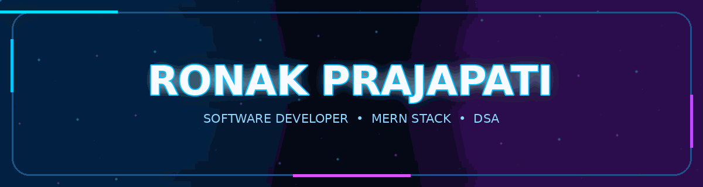

  <!-- Cinematic Animated Banner with Your Name -->
  

   

  <!-- Animated Introduction -->
  

    

  <!-- Contact and Coding Profiles -->
  
  
  

    

  

---

## 👨‍💻 About Me

<table>
<tr>
<td width="62%" valign="top">

I'm a Computer Science and Engineering student passionate about software development, algorithmic problem-solving, and building practical applications.

-  B.Tech CSE — 2027 batch
-  Aspiring Software Engineer
-  Focused on MERN Stack Development
-  Practising Data Structures and Algorithms in C++
-  Building projects to strengthen software engineering fundamentals
-  Continuously improving code quality and problem-solving skills

**My approach:** Understand the problem, design the solution, write clean code, and keep improving.

</td>
<td width="38%" align="center" valign="middle">

  
</a>
</td>
</tr>
</table>

---

## 🛠️ Tech Stack

<table>
<tr>
<th>💻 Languages</th>
<th>🌐 Web Development</th>
<th>🗄️ Databases</th>
<th>🔧 Tools & Platforms</th>
</tr>
<tr>
<td align="center" valign="middle">

</td>
<td align="center" valign="middle">

</td>
<td align="center" valign="middle">

</td>
<td align="center" valign="middle">

</td>
</tr>
</table>

---

## 🧩 LeetCode | Problem Solving

  

---

## 📊 GitHub Analytics

  

---

## 🐍 Contribution Snake

Every contribution is another step forward.

<picture>
  <source
    media="(prefers-color-scheme: dark)"
    srcset="https://raw.githubusercontent.com/ronnak56/ronnak56/output/github-snake-dark.svg"
  />
  <source
    media="(prefers-color-scheme: light)"
    srcset="https://raw.githubusercontent.com/ronnak56/ronnak56/output/github-snake.svg"
  />
  
</picture>

---

## 🎯 Current Focus

<table>
<tr>
<td align="center" width="33%">

### 🌐 Full-Stack Development

Building responsive web applications using React, Node.js, Express, and MongoDB.

</td>
<td align="center" width="33%">

### 🧠 Problem Solving

Strengthening DSA, algorithm design, complexity analysis, and coding skills using C++.

</td>
<td align="center" width="33%">

### 🚀 Project Development

Applying concepts through practical projects, APIs, authentication, and database integration.

</td>
</tr>
</table>

---

##  Let's Connect and Build Something Meaningful

---

---

  <!-- Neon animated footer -->
  

   

  
  &nbsp;
  

  

  Made with 💙, curiosity, and lots of code.

